# 🏛️ AI, ML, DL, & Data Science: Revisiting Definitions and Their Interplay

## 🎯 1. Learning Objectives

After completing this lesson, you will be able to:

- Articulate the distinct scopes and nuanced definitions of Artificial Intelligence (AI), Machine Learning (ML), Deep Learning (DL), and Data Science from an advanced perspective.
- Clearly explain the hierarchical and overlapping relationships between these foundational fields.
- Understand how these domains build upon and synergistically complement each other in state-of-the-art applications and research.
- Appreciate the pivotal and evolving role of data as the common thread and driving force in modern AI.

## 🚀 2. Introduction: Beyond the Buzzwords

As you continue on this Odyssey, your existing familiarity with terms like Artificial Intelligence, Machine Learning, Deep Learning, and Data Science provides a valuable starting point. These terms are foundational, yet their precise definitions and interrelations are often discussed with varying degrees of nuance, especially as the fields rapidly evolve.

The purpose of this lesson is not merely to reiterate basic definitions, but to **revisit them through an advanced lens**. We aim to solidify your understanding of their individual characteristics, their critical interconnections, and how they collectively form the landscape of modern intelligent systems. This refined perspective is crucial for navigating the complex topics and research frontiers we will explore.

---

## 🧠 3. Core Definitions Revisited: An Advanced Perspective

Let's examine these key domains with the depth required for advanced study.

### 3.1 Artificial Intelligence (AI): The Enduring Quest for Machine Cognition

**Artificial Intelligence (AI)** remains the broadest and most aspirational field, encompassing the multidisciplinary scientific and engineering endeavor to create systems that can perceive their environment, reason about it, learn from experience, and take actions to achieve specific goals, mimicking or surpassing human cognitive abilities.

- **Evolving Paradigms:** While early AI (Symbolic AI or GOFAI) focused on logic, knowledge representation, and search, the contemporary AI landscape is heavily dominated by data-driven approaches, particularly those stemming from Machine Learning. However, the dialogue between symbolic and connectionist (data-driven) approaches continues, especially in areas like neuro-symbolic AI, which aims for more robust and interpretable systems.
- **Spectrum of Intelligence:** It's important to distinguish between:
  - **Artificial Narrow Intelligence (ANI):** AI specialized for specific tasks (e.g., image classification, language translation), which represents the vast majority of current AI successes.
  - **Artificial General Intelligence (AGI):** Hypothetical AI with human-like cognitive abilities across a wide range of tasks, capable of learning and adapting to novel situations. This remains a long-term research goal.
  - **Artificial Superintelligence (ASI):** AI that would significantly surpass human intellectual capabilities. The implications and timelines for ASI are subjects of ongoing debate and research.

### 3.2 Machine Learning (ML): The Engine of Adaptive AI

**Machine Learning (ML)** is a core subfield of AI and a fundamental methodology for achieving intelligent behavior. ML algorithms enable systems to learn patterns and make decisions or predictions from data, without being explicitly programmed for every conceivable scenario.

- **Core Principle:** ML systems learn by optimizing a defined objective (e.g., minimizing a loss function) based on patterns inferred from training data. This data-driven adaptability is what distinguishes ML from traditional rule-based systems.
- **Key Paradigms (Advanced Viewpoint):**
  - **Supervised Learning:** Learning from labeled data $(X, y)$ to map inputs to outputs. The focus for advanced learners often shifts to understanding complex model capacities, generalization theory, and advanced algorithms (e.g., sophisticated ensemble methods, advanced kernel machines).
  - **Unsupervised Learning:** Learning from unlabeled data $X$ to discover inherent structure, representations, or patterns (e.g., advanced clustering, manifold learning, density estimation, representation learning with autoencoders).
  - **Reinforcement Learning (RL):** Agents learning to make sequences of decisions in an environment to maximize cumulative rewards. Advanced topics include deep RL, model-based RL, exploration-exploitation trade-offs in complex domains, and multi-agent systems.
  - **Self-Supervised Learning (SSL):** A increasingly important paradigm where supervisory signals are derived from the data itself, bridging unsupervised and supervised learning, particularly powerful for pretraining large models.

### 3.3 Deep Learning (DL): Architectures of Depth and Scale

**Deep Learning (DL)** is a specialized and highly impactful subfield of Machine Learning, characterized by the use of artificial neural networks (ANNs) with multiple processing layers (hence "deep"). These layers learn hierarchical representations of data.

- **Hierarchical Representation Learning:** The "depth" allows DL models to automatically learn a cascade of features: initial layers learn low-level features (e.g., edges in an image, basic phonetic units in speech), intermediate layers compose these into more complex patterns, and final layers learn highly abstract representations relevant to the task. This automated feature engineering from raw data is a defining characteristic and a primary reason for DL's success.
- **Key Enablers:** The resurgence and dominance of DL are attributed to algorithmic advancements (e.g., better activation functions, optimizers, regularization techniques), the availability of massive datasets, and significant increases in computational power (especially GPUs and TPUs).
- **Scope:** DL encompasses a diverse array of architectures like Convolutional Neural Networks (CNNs), Recurrent Neural Networks (RNNs), Transformers, Generative Adversarial Networks (GANs), and more, each suited for different types of data and tasks.

### 3.4 Data Science: The Interdisciplinary Pursuit of Data-Driven Insights

**Data Science** is a broad, interdisciplinary field dedicated to extracting knowledge, insights, and value from data in all its forms. While it heavily utilizes ML and DL, it is not exclusively defined by them.

- **Holistic Approach:** Data Science integrates principles and practices from statistics, computer science (including algorithms, data structures, software engineering, and ML/DL), data engineering (data acquisition, storage, processing), data visualization, and crucially, domain expertise.
- **Full Data Lifecycle Management:** A data scientist is often involved in the end-to-end process: defining the problem, collecting and cleaning data, performing exploratory data analysis (EDA), selecting and building models (often ML/DL), interpreting results, visualizing findings, communicating insights to stakeholders, and deploying/monitoring solutions.
- **Impact-Driven:** The ultimate goal of data science is typically to drive informed decision-making, solve business problems, or advance scientific understanding through data-driven approaches.

---

## 🔗 4. The Interconnections: A Unified Ecosystem

These fields are not isolated silos but form a deeply interconnected ecosystem, working synergistically.

```mermaid
%% Figure 0.0.2.1: Conceptual Relationship between AI, ML, DL, and Data Science
graph TD
    %% Core Nodes
    AI[🧠 Artificial Intelligence]:::ai --> ML[🤖 Machine Learning]:::ml
    ML --> DL[🧬 Deep Learning]:::dl

    %% Data Science Branch
    DS[📊 Data Science]:::ds --> ML
    DS --> STAT[📐 Statistics]:::stat
    DS --> VIS[📈 Data Visualization]:::vis
    DS --> DOMAIN[🏛️ Domain Expertise]:::domain
    DS --> DE[🛠️ Data Engineering]:::de

    %% Extra Dependency
    STAT --> ML
    DE -.-> ML

    %% Style Definitions
    classDef ai fill:#C7A947,stroke:#333,stroke-width:2px,color:#fff,font-weight:bold
    classDef ml fill:#38BDF8,stroke:#1F2937,stroke-width:2px,color:#fff,font-weight:bold
    classDef dl fill:#7D56F4,stroke:#1F2937,stroke-width:2px,color:#fff,font-weight:bold
    classDef ds fill:#0B1A35,color:#F9F6EF,stroke:#C7A947,stroke-width:2px,font-weight:bold
    classDef stat fill:#1B1F23,color:#FDFDFD,stroke:#38BDF8,stroke-width:1px
    classDef vis fill:#1B1F23,color:#FDFDFD,stroke:#38BDF8,stroke-width:1px
    classDef domain fill:#1B1F23,color:#FDFDFD,stroke:#38BDF8,stroke-width:1px
    classDef de fill:#1B1F23,color:#FDFDFD,stroke:#38BDF8,stroke-width:1px

    subgraph Data_Science_Pillars ["Data Science Pillars"]
        STAT
        VIS
        DOMAIN
        DE
    end
```

_Figure: Conceptual Relationship between AI, ML, DL, and Data Science._

- **AI as the Apex Goal:** The ambition to create intelligent systems.
- **ML as a Primary Pathway:** Providing the core learning algorithms that enable AI.
- **DL as a Powerful Toolkit within ML:** Offering state-of-the-art techniques, especially for complex, unstructured data.
- **Data Science as the Applied Discipline:** Utilizing AI, ML, DL, statistical methods, and data engineering practices to solve real-world problems and extract knowledge. Statistics provides the rigorous framework for inference and model evaluation, while Data Engineering builds the infrastructure to handle data at scale.

---

## ⚙️ 5. The Role of Data: The Indispensable Fuel

Across modern ML, DL, and applied Data Science, **data reigns supreme.**

- The sophistication and performance of contemporary AI models are intrinsically linked to the **volume, quality, diversity, and representativeness** of the data used for their training and validation.
- The adage "garbage in, garbage out" is particularly poignant in these fields. Advanced algorithms can only uncover patterns that are latent within the data.
- Significant portions of this Odyssey will be dedicated to understanding advanced data preprocessing, representation learning, feature engineering, and managing large-scale datasets, acknowledging data as the critical raw material for intelligence.

---

## 💡 6. Why These Nuanced Distinctions Matter for Advanced Study

For an advanced learner or practitioner, a precise understanding of these domains and their interplay is crucial for:

- **Strategic Method Selection:** Appropriately choosing algorithms, architectures, and evaluation metrics suited to the specific nature of a problem and the available data.
- **Critical Assessment of Research:** Evaluating the claims, scope, and limitations of new research papers and techniques within their correct context (e.g., understanding if a DL advancement is a specific ML improvement or a broader AI paradigm shift).
- **Informed Problem Formulation:** Defining research questions or project goals with clarity regarding which domain's tools and theories are most applicable.
- **Effective Interdisciplinary Communication:** Using terminology accurately and effectively when collaborating with experts from diverse backgrounds (e.g., statisticians, software engineers, domain specialists).
- **Navigating the AI Research Landscape:** Identifying relevant communities, conferences, journals, and bodies of literature for continuous learning and contribution.

---

## 🔑 7. Key Takeaways

- **AI** is the grand objective of imbuing machines with intelligent capabilities.
- **Machine Learning (ML)** provides the core data-driven learning mechanisms to achieve AI.
- **Deep Learning (DL)** offers a powerful class of ML techniques based on multi-layered neural networks, excelling at hierarchical representation learning.
- **Data Science** is the interdisciplinary field that applies these tools, along with statistics and domain expertise, to extract actionable insights from data.
- These fields are deeply intertwined, with high-quality data serving as the foundational element for progress in most modern AI endeavors.

---

## 🔗 9. Navigation

🔙 **Previous Topic:** [Embarking on the Journey: Purpose, Audience, and Your AI Odyssey](0_0_1_Embarking_on_the_Journey_Purpose_and_Audience_of_this_Module.md)

🔗 **Next Topic:** [AI Subfields: A Roadmap from Core Techniques to Research Frontiers](0_0_3_AI_Subfields_A_Roadmap_from_Core_Techniques_to_Research_Frontiers.md)
