# 🏛️ Critical Thinking in AI: Evaluating Trends, Hype, and Research Quality

## 🎯 1. Learning Objectives

After completing this lesson, you will be able to:

- Understand the profound importance of a critical mindset when engaging with AI news, emerging trends, and research publications.
- Identify common patterns of hype within the AI field and develop strategies to distinguish genuine technological breakthroughs from overstated claims.
- Outline a foundational approach to critically evaluating AI research papers, focusing on methodology, empirical evidence, potential limitations, and overall contribution.
- Recognize common pitfalls, biases (algorithmic and cognitive), and challenges that can affect AI research and its real-world applications.
- Appreciate the value of continuous learning, seeking diverse perspectives, and rigorous questioning in refining your critical judgment in AI.

## 🚀 2. Introduction: The Importance of a Critical Mindset in a Dynamic Field

Artificial Intelligence is a domain characterized by breathtaking advances, rapid innovation, and consequently, significant public, media, and commercial attention. This dynamism is incredibly exciting, but it also fosters an environment where new trends can be easily misconstrued, technological capabilities can be prematurely overstated, and research findings might be presented without adequate discussion of their limitations or societal impact.

For an advanced learner, aspiring practitioner, or researcher embarking on "The AI Odyssey," cultivating a robust critical thinking toolkit is not merely beneficial—it is absolutely essential. A discerning, analytical mindset will empower you to navigate the pervasive noise, identify developments of true significance, understand the nuanced capabilities and constraints of different AI approaches, and ultimately, contribute meaningfully, ethically, and responsibly to this transformative field. This lesson aims to lay the groundwork for developing that crucial critical perspective.

---

## 🧐 3. Discerning Signal from Noise: AI Trends vs. Hype

The history of Artificial Intelligence has been marked by cycles of intense optimism and substantial funding (often termed "AI summers"), sometimes followed by periods where progress appeared to slow, leading to "AI winters" of reduced investment and disillusionment. Understanding this cyclical pattern, often conceptualized through hype cycles, is crucial for maintaining a balanced perspective.

### 3.1 The AI Hype Cycle (Conceptual)

While various models exist (e.g., Gartner's Hype Cycle), the general concept posits that emerging technologies often traverse several distinct phases:

- **Technology Trigger:** A significant breakthrough or early success generates considerable initial interest and media coverage.
- **Peak of Inflated Expectations:** Enthusiasm and speculation often outpace the technology's current capabilities, leading to broad, sometimes unrealistic, claims and widespread excitement.
- **Trough of Disillusionment:** Initial attempts to apply the technology broadly may encounter practical challenges or fail to meet the overly optimistic expectations, leading to waning interest and skepticism.
- **Slope of Enlightenment:** The technology's real-world benefits, practical applications, and limitations begin to be more clearly understood and refined through focused development and successful case studies.
- **Plateau of Productivity:** Mainstream adoption occurs as the technology's value proposition becomes well-established, its ecosystem matures, and its benefits become broadly applicable and realized.

```mermaid
%% Figure 0.0.4.1: Conceptual AI Hype Cycle
graph LR
  subgraph Hype Cycle Stages
    A[💡<br><b>Technology Trigger</b><br><i>Exciting breakthroughs & media buzz</i>]:::trigger
    B[🚀<br><b>Peak of Inflated Expectations</b><br><i>Overpromising & hype spikes</i>]:::peak
    C[💤<br><b>Trough of Disillusionment</b><br><i>Reality sets in, disillusionment</i>]:::trough
    D[🧭<br><b>Slope of Enlightenment</b><br><i>Real use-cases & learning emerge</i>]:::enlightenment
    E[🏗️<br><b>Plateau of Productivity</b><br><i>Widespread, practical adoption</i>]:::plateau

    A --> B --> C --> D --> E

end

%% Stage Styles
classDef trigger fill:#3b8ea5,stroke:#2c3e50,color:#ffffff,stroke-width:2px,font-weight:bold
classDef peak fill:#48b9c7,stroke:#2c3e50,color:#ffffff,stroke-width:2px,font-weight:bold
classDef trough fill:#acd7dd,stroke:#2c3e50,color:#111111,stroke-width:2px,font-weight:bold
classDef enlightenment fill:#d0e6ef,stroke:#2c3e50,color:#111111,stroke-width:2px,font-weight:bold
classDef plateau fill:#e6f3f7,stroke:#2c3e50,color:#111111,stroke-width:2px,font-weight:bold

```

_**Figure:** A conceptual representation of a technology hype cycle._

### 3.2 Evaluating AI News and Claims Critically

When encountering new AI-related claims, whether in news articles, blog posts, or even pre-print research, consider applying these critical filters:

- **Source and Credibility:** Is the information from a peer-reviewed academic journal, a reputable conference proceeding, a company's marketing material, a technical blog by a known expert, or a general media outlet? Understanding the potential motivations and review standards of the source is key.
- **Specificity and Measurability of Claims:** Are the claims concrete and supported by quantifiable metrics, or are they vague, anecdotal, and overly broad (e.g., "human-like understanding")?
- **Evidence Provided:** Is robust empirical evidence presented (e.g., detailed experimental results, performance on established benchmarks, ablation studies)? Or are claims based on limited demonstrations or theoretical arguments alone?
- **Acknowledgement of Limitations and Risks:** Does the source discuss the limitations, potential failure modes, ethical considerations, or areas where the AI might not perform well? A balanced perspective that acknowledges downsides is often a sign of more credible reporting.
- **Reproducibility and Openness:** Particularly for research claims, are the methodologies, datasets, and ideally, the code described in sufficient detail so that others could, in principle, attempt to reproduce the results? Openness in science is a strong indicator of confidence and facilitates community validation.
- **Context and Significance:** How does this development fit into the broader landscape of AI? Is it an incremental improvement on existing techniques, a novel application, or a potential paradigm shift? Who benefits from this narrative?

---

## 🔬 4. Approaching AI Research Papers: A Primer for Advanced Learners

Reading and understanding research papers is a cornerstone of advanced study and contribution in AI. While this skill develops over time with practice, here's an initial framework for critically engaging with academic literature:

- **Structure of a Typical Paper:** Most AI research papers follow a general structure, though variations exist:
  - **Abstract:** A concise summary (typically 150-300 words) of the problem addressed, the proposed method, key results, and their significance.
  - **Introduction:** Provides background information, motivates the problem, briefly surveys related work, and clearly states the paper's contributions and outline.
  - **Related Work / Background:** A more detailed review and discussion of prior research relevant to the paper's topic, highlighting gaps or limitations that the current work aims to address.
  - **Methodology / Proposed Approach:** A detailed description of the new algorithm, model architecture, theoretical framework, or system design. This is often the core technical section and should be clear enough for an expert to understand and potentially replicate the work.
  - **Experiments & Results:** Describes the experimental setup, datasets used, evaluation metrics, comparisons with baseline methods, and presentation of the main quantitative and/or qualitative findings.
  - **Discussion / Analysis:** Interpretation of the results, insights gained, discussion of why the proposed method performs as it does, and, importantly, an honest assessment of its limitations.
  - **Conclusion & Future Work:** Summarizes the key contributions and often suggests potential avenues for future research.
  - **References:** Citations to relevant prior work.
- **Key Elements for Critical Reading:**
  - **Problem Definition & Motivation:** Is the problem clearly defined, well-motivated, and genuinely significant? What assumptions are being made about the problem?
  - **Novelty & Core Contribution:** What is the specific, novel contribution of this paper? Is it a new algorithm, a novel architecture, a new theoretical insight, a new dataset, or a significant empirical result? How does it advance the state of the art?
  - **Methodological Soundness & Clarity:** Is the proposed approach clearly and rigorously described? Are the design choices well-justified, either theoretically or empirically? Are there any unstated assumptions or potential flaws in the methodology?
  - **Empirical Validation & Rigor:**
    - Are the experiments well-designed to test the claims? Are appropriate and challenging datasets used?
    - Are the evaluation metrics suitable for the task and claims?
    - Are comparisons to relevant baselines and prior SOTA methods fair and comprehensive?
    - Are results statistically significant? Are error bars or confidence intervals reported where appropriate?
    - Are ablation studies performed to understand the contribution of different components of the proposed method?
  - **Reproducibility:** Does the paper provide sufficient detail (and ideally, access to code and data) to allow other researchers to reproduce the findings?
  - **Limitations & Scope of Claims:** Does the paper honestly discuss the limitations of the proposed approach? Are the conclusions drawn well-supported by the evidence, or are they overly broad?
- **The Peer-Review Process:** Understand that publication in reputable, peer-reviewed venues (e.g., top-tier conferences like NeurIPS, ICML, ICLR, CVPR, ACL, KDD, or esteemed journals) generally indicates that the work has been vetted by several experts in the field. However, peer review is a human process and is not infallible. A critical mindset remains essential even when reading published work.
- **Open Science Practices:** The increasing adoption of open science practices—such as publishing code on platforms like GitHub, sharing datasets, and posting pre-prints on archives like arXiv—greatly enhances transparency, reproducibility, and allows for more thorough community scrutiny and collaborative advancement.

---

## ⚠️ 5. Recognizing Common Pitfalls and Biases in AI

A critical thinker in AI must also be acutely aware of potential pitfalls and biases that can influence research, development, and deployment:

- **Cognitive Biases in Research:**
  - **Confirmation Bias:** The tendency to seek out, interpret, favor, and recall information that confirms or supports one's pre-existing beliefs or hypotheses. This can affect how researchers design experiments or interpret ambiguous results.
  - **Publication Bias:** The tendency for positive or statistically significant results to be published more readily than negative or null results, potentially skewing the perceived effectiveness of certain techniques.
- **Methodological Pitfalls:**
  - **Overfitting to Benchmarks:** Models that are highly optimized for specific benchmark datasets may not generalize well to new, unseen data or slightly different real-world conditions.
  - **P-hacking or Data Dredging:** Selectively reporting results or analyses that yield statistically significant findings, while ignoring those that do not.
  - **Lack of Proper Baselines:** Comparing a new method only to weak or outdated baselines, which can exaggerate its perceived improvement.
- **Algorithmic and Data Bias:**
  - AI models, particularly those trained on large-scale datasets reflecting historical or societal biases, can learn, perpetuate, and even amplify these biases. This can lead to unfair, discriminatory, or inequitable outcomes in critical applications such as loan approvals, hiring processes, medical diagnosis, or criminal justice. (This will be a major topic in a dedicated Ethics Part of the Odyssey).
- **The "Black Box" Problem & Explainability (XAI):** Many powerful deep learning models operate as "black boxes," making it challenging to understand the internal reasoning behind their predictions or decisions. While Explainable AI (XAI) techniques aim to provide insights, interpreting these explanations themselves often requires critical evaluation to avoid misleading conclusions.
- **Misleading Metrics:** Choosing or highlighting metrics that do not fully capture the desired performance characteristics can be misleading. For instance, high accuracy on an imbalanced classification task can be a poor indicator of a model's utility if it performs poorly on the minority class.

---

## 💡 6. Cultivating Your Critical Toolkit

Developing robust critical thinking skills in the context of AI is an iterative and ongoing process. Consider these practices:

- **Question Assumptions Relentlessly:** For any AI system, model, or research claim, always ask: What are the underlying assumptions being made about the data, the problem, the evaluation, and the context of use? Are these assumptions valid and explicitly stated?
- **Seek Diverse Perspectives and Sources:** Actively look for information from multiple sources, including those that may offer critiques or alternative viewpoints to a dominant narrative. Follow discussions in the research community but apply the same critical lens.
- **Distinguish Statistical Significance from Practical Importance:** A result that is statistically significant (i.e., unlikely to have occurred by chance) may not always translate to a practically meaningful or impactful improvement in a real-world scenario. Consider effect sizes and contextual relevance.
- **Embrace Nuance and Context:** AI is rarely a field of absolute truths. Most techniques involve trade-offs (e.g., accuracy vs. computational cost, performance vs. interpretability). The "best" approach is almost always context-dependent.
- **Commit to Continuous Learning & Re-evaluation:** The AI field evolves at an extraordinary pace. What was considered state-of-the-art or a fundamental limitation yesterday might be different today. Continuously update your knowledge and be willing to re-evaluate your understanding in light of new evidence and advancements.

---

## 🔑 7. Key Takeaways

- Critical thinking is a non-negotiable skill for anyone serious about understanding and contributing to the field of AI.
- Actively distinguish between substantiated AI trends and unsubstantiated hype by questioning sources, evidence, and the scope of claims.
- Approaching AI research papers with a critical eye involves scrutinizing their problem definition, methodology, empirical validation, and acknowledged limitations.
- Be vigilant for common cognitive and methodological biases that can influence AI research and be aware of the societal implications of algorithmic bias.
- Cultivating critical judgment is an ongoing process of questioning, seeking diverse insights, understanding nuance, and committing to lifelong learning.

---

## 🔗 9. Navigation

🔙 **Previous Topic:** [The AI Archipelago: Mapping Subfields from Core Techniques to Research Frontiers](0_0_3_AI_Subfields_A_Roadmap_from_Core_Techniques_to_Research_Frontiers.md)

🔗 **Next Topic:** [Learning Strategies for This Odyssey: How to Use This Resource](0_0_5_Learning_Strategies_for_This_Odyssey_How_to_Use_This_Resource.md)
